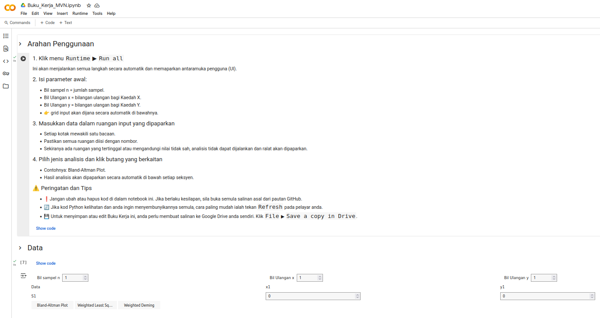

# Kalkulator Numerical Method Verification
*Kemaskini 2025-05-30*

## Pengenalan
Kalkulator ini dibangunkan bagi membantu pegawai makmal dan penyelidik menjalankan *Method Verification* dengan lebih mudah menggunakan antara muka ringkas di Google Colab. Tujuannya adalah untuk mengurangkan kebergantungan kepada perisian statistik berbayar, serta boleh dikongsi dengan rakan sejawat.

## Skop Penggunaan
Kalkulator ini hanya sesuai digunakan untuk:
- Kaedah yang menghasilkan **data berangka** *numerical data*
- Keputusan yang bersifat *internal continuous response*

Ia **tidak sesuai** untuk:
- Ujian kualitatif
- Data bersifat kategori atau ordinal

## Jenis Analisis Yang Disokong
### 1. **Plot Bland-Altman**
Digunakan untuk menilai **kesepakatan** *agreement* antara dua kaedah pengukuran. Plot ini membantu mengenal pasti sama ada perbezaan antara kaedah adalah konsisten merentasi julat nilai.

### 2. **Weighted Least Squares (WLS)**
Regresi WLS digunakan apabila **varians ralat pembolehubah bersandar adalah tidak seragam** antara titik data (heteroskedastisiti). Ia memberikan **berat** yang sesuai kepada setiap pemerhatian bagi menghasilkan garis regresi yang lebih mantap.

### 3. **Weighted Deming Regression**
Kaedah regresi yang mengambil kira ralat pada kedua-dua paksi X dan Y, sesuai untuk membandingkan dua kaedah yang **kedua-duanya mempunyai ralat pengukuran**. Versi tertimbang *weighted* digunakan apabila ralat berubah-ubah mengikut magnitud bacaan.

## Akses Kalkulator
Klik pada butang ini untuk mengakses kalkulator 

👉Lihat versi statik notebook:

*Arahan penggunaan penuh tersedia di dalam notebook.*

## ❓ Soalan Lazim (FAQ)

**S: Saya nampak kod Python, perlu buat apa?**  
**J:** Kalkulator ini dibangungkan dengan menggunakan Python. Kod boleh muncul selepas anda klik butang tertentu. Untuk sembunyikan semula, tekan `Refresh` pada pelayar atau buka semula notebook dari pautan asal.

**S: Saya dapat mesej ralat selepas masukkan data.**  
**J:** Sila pastikan semua medan input diisi, dan hanya menggunakan nombor. Jangan tinggalkan medan kosong atau letak simbol yang tidak diperlukan.

**S: Saya tidak boleh simpan perubahan pada notebook.**  
**J:** Anda perlu membuat salinan ke Google Drive anda: `File` ▶ `Save a copy in Drive`.

**S: Bolehkah saya guna keputusan daripada kalkulator ini untuk laporan rasmi?**  
**J:** Ya. Anda boleh menggunakan hasil analisis seperti plot, persamaan regresi, dan statistik ringkasan dalam laporan anda. Namun, sebarang kesimpulan mesti dibuat oleh pengguna sendiri berdasarkan interpretasi yang sesuai. Kalkulator ini tidak menjana kesimpulan automatik.

## Tentang Projek Ini

Dibangunkan oleh **sithsenz** sebagai sebahagian inisiatif untuk memperkemas ujian pengesahan kaedah di makmal diagnostik dan penyelidikan.

*[Table of Content](../index.md)*
