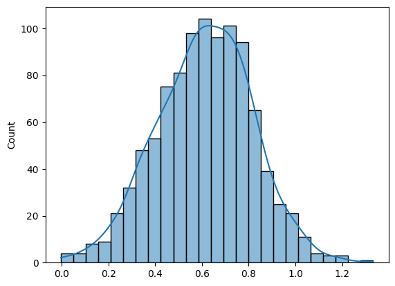
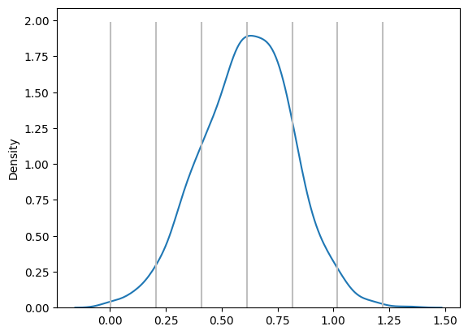
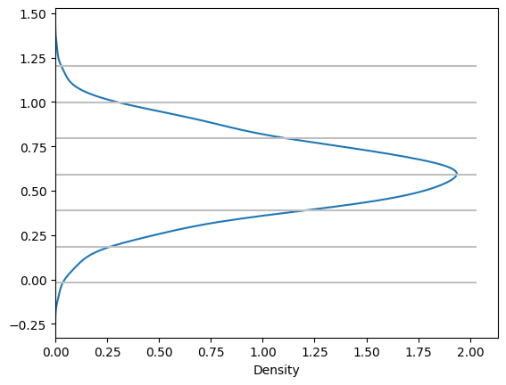
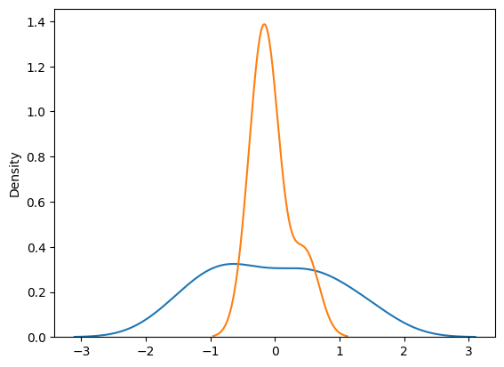
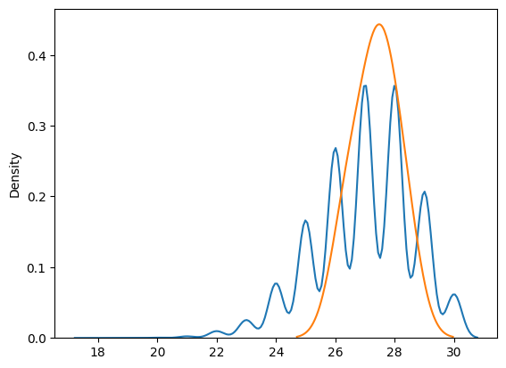
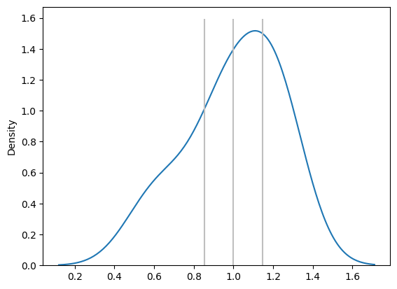
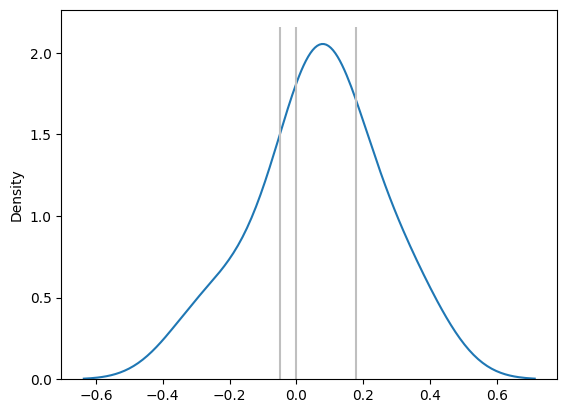
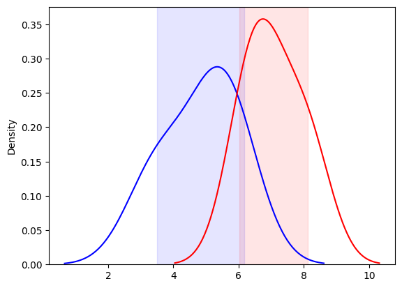

# Biostatistics Revisited: Practical Insights from an MLS
Biostatistics is a powerful tool that transcends research and is integral to everyday operations in medical laboratories.
This article aims to revisit biostatistical concepts from the perspective of a Medical Laboratory Scientist (MLS),
focusing on how these concepts apply to quality control (QC) monitoring, method validation, and routine laboratory processes.
Rather than providing a basic lesson, this article assumes a foundational understanding of biostatistics and presents a fresh, practical perspective.

## Data Collection in the Laboratory
In the lab, data collection is a routine activity. Whether we are validating a method or monitoring QC,
the data we generate through measurements plays a critical role in ensuring accuracy and reliability.
Here are four common scenarios:
1. Single Measurement on a Single Sample: Testing a patient’s specimen.
2. Repeated Measurements on a Single Sample: Internal Quality Control (IQC) monitoring.
3. Single Measurement on Multiple Samples: Method validation without replication.
4. Repeated Measurements on Multiple Samples: Method validation with replication.

## Data Presentation
While there are many ways to present data, the histogram is particularly favored due to its simplicity and effectiveness in statistical analysis.
Let’s consider a histogram of HBsAg signal-to-cutoff (S/CO) readings from 1,000 patients as an example.
This representation can easily be expanded into more advanced statistical concepts.

### Probability Distributions
Understanding probability distributions, particularly the normal distribution, is crucial for interpreting lab data.
Most probability distributions can be described using one or two key parameters.
For the normal distribution, these parameters are:
+ Mean (µ): 0.612
+ Standard Deviation (σ): 0.2031

From the Kernel Density Estimation (KDE) plot, we can illustrate how the data is distributed,
and we can apply the three-sigma rule to determine coverage:
+ μ ± 1σ → 68%
+ μ ± 2σ → 95%
+ μ ± 3σ → 99.7%

In practice, the normal distribution can be used to estimate measurement uncertainty with 95% coverage by applying a coverage factor of 2.
For other types of distributions, a modeling approach can be adopted.

If we rotate the KDE plot by 90 degrees, it resembles a Levey-Jennings (LJ) Chart, which is used for QC monitoring.

## Central Limit Theorem (CLT)
The Central Limit Theorem (CLT) is fundamental to understanding the behavior of sample means. It states that with increasing sample size,
the sample mean will approach the true population mean (𝑥̅ → µ) and the sample standard deviation will approach the population standard deviation (s → σ).

")

However, when performing repeated measurements—such as 6 replicates over 5 days—the mean of the sample means provides the best estimate
of the population mean, even with smaller sample sizes.

### Practical Applications of CLT
+ CLT allows for convergence of almost any distribution, making it a powerful tool for estimating the population mean with a relatively small number of samples.

+ However, improper use of CLT can distort data. For example, CLT can transform a spiky distribution into a normal distribution, potentially leading to misleading analysis.

## Confidence Intervals (CI)
While Confidence Intervals (CI) are explicitly used in research, they are also implicitly applied in routine lab processes.
CIs provide a range of values within which the true population mean is expected to lie. For example:

 of CI from the same population")

+ A 50% CI means half of the calculated intervals will contain the population mean.
+ A 95% CI means 95% of the intervals will contain the population mean.

In practice, we encounter CIs in Method Comparison Studies and Lot-to-Lot Verification (LTLV).
For instance, if the 95% CI of the slope in a method comparison study contains 1, the methods are considered proportionally comparable.

## Closing Thoughts
Understanding the overarching concepts in biostatistics, rather than memorizing formulas, is essential for applying these principles in a laboratory setting.
With practice, laboratory professionals can build intuition and proficiency, allowing for more accurate interpretation of data and improved decision-making.
