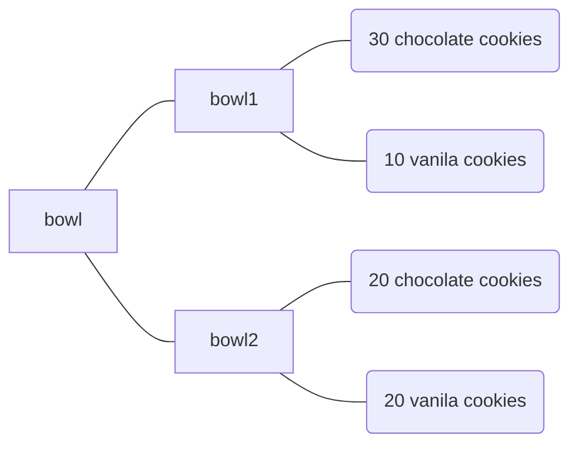

# Bayesian in Python

## Bayesian Theorem

### Theorem 1
>$$P(A | B) = \frac{P(A \cap B)}{P(B)}$$

### Theorem 2
>$$P(A | B) = \frac{P(B | A) \times P(A)}{P(B)}$$

### Theorem 3
>$$P(A) = \sum_i P(A | B_i) \times P(B_i)$$

## Cookies Problem

