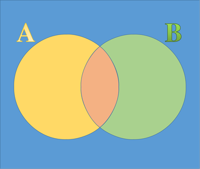

# Translating Clinical Threshold to Laboratory Performance Specifications
*Last updated 2025-05-20*

## Two Forms of the Theorem
### The Probability Form

The usual way of presenting Bayesian Theorem.

>When P(A) and P(B) is not mutually exclusive:
  
>$$P(A \cap B) = P(A) \times P(B | A)$$  
>$$P(B \cap A) = P(B) \times P(A | B)$$  

>but,

>$$P(B \cap A) = P(A \cap B)$$  

>hence,

>$$P(B) \times P(A | B) = P(A) \times P(B | A)$$

>[!Note]
>$$P(A | B) = \frac{P(A) \times P(B | A)}{P(B)}$$

In diagnostic testing, probability of Diseased (D+) when Test (T) is positive:
>[!Note]
>$$P(D+ | T+) = \frac{P(D+) \times P(T+ | D+)}{P(T+)}$$

Probability of Not Diseased (D-) when Test (T) is positive:
>$$P(D- | T+) = \frac{P(D-) \times P(T+ | D-)}{P(T+)}$$

### The Odds Form
What is the odds that the patient has the disease when the test is positive?

>$$\frac{P(D+|T+)}{P(D-|T+)} = \frac{\frac{P(D+) \times P(T+ | D+)}{P(T+)}}{\frac{P(D-) \times P(T+ | D-)}{P(T+)}}$$

>$$\frac{P(D+|T+)}{P(D-|T+)} = \frac{P(D+) \times P(T+ | D+)}{P(D-) \times P(T+ | D-)}$$
>
>$$\frac{P(D+|T+)}{P(D-|T+)} = \frac{P(D+)}{P(D-)} \times \frac{P(T+ | D+)}{P(T+ | D-)}$$

In odds terms:

>[!Note]
>$$\text{Post-Test Odds} = \text{Pre-Test Odds} \times \text{Likelihood Ratio}$$

>Likelihood Ratio (LR) when Test is positive: $$LR = \frac{P(T+ | D+)}{P(T+ | D-)}$$

>but Sensitivity (Sn) is  
>$$Sn = P(T+|D+)$$  
>while, Specificity (Sp) is  
>$$Sp = P(T-|D-)$$  
>and, $$P(T+|D-) + P(T-|D-) = 1$$  

>[!Note]
>$$LR = \frac{Sn}{1-Sp}$$

### Probability :arrows_counterclockwise: Odds
Probability :arrow_right: Odds
>$$\text{Probability} = \frac{\text{Odds}}{1 + \text{Odds}}$$

Odds ➡️ Probability
>$$\text{Odds} = \frac{\text{Probability}}{1 - \text{Probability}}$$

## Clinical Threshold

*[Table of Content](../../index.md)*
