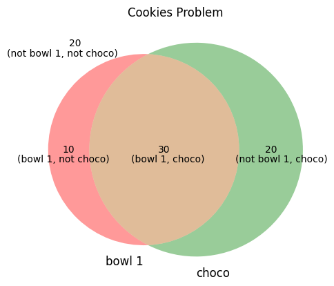

# Translating Clinical Threshold to Laboratory Performance Specifications
*Last updated 2025-05-20*

## Two Forms of the Theorem
### The Probability Form
{:width="36px"}
The usual way of presenting Bayesian Theorem.
>When P(A) and P(B) is not mutually exclusive:  
>$$P(A \cap B) = P(A) \times P(B | A)$$  
>$$P(B \cap A) = P(B) \times P(A | B)$$  
>but, $$P(B \cap A) = P(A \cap B)$$  
>hence, $$P(B) \times P(A | B) = P(A) \times P(B | A)$$  
>$$P(A | B) = \frac{P(A) \times P(B | A)}{P(B)}$$

In diagnostic testing,
>Probability of Diseased (D+) when Test (T) is positive:  
>$$P(D+ | T+) = \frac{P(D+) \times P(T+ | D+)}{P(T+)}$$  
>Probability of Not Diseased (D-) when Test (T) is positive:  
>$$P(D- | T+) = \frac{P(D-) \times P(T+ | D-)}{P(T+)}$$

### The Odds Form
What is the odds that the patient has the disease when the test is positive?  
>$$\frac{P(D+|T+)}{P(D-|T+)} = \frac{\frac{P(D+) \times P(T+ | D+)}{P(T+)}}{\frac{P(D-) \times P(T+ | D-)}{P(T+)}}$$
>$$\frac{P(D+|T+)}{P(D-|T+)} = \frac{P(D+) \times P(T+ | D+)}{P(D-) \times P(T+ | D-)}$$
>$$\frac{P(D+|T+)}{P(D-|T+)} = \frac{P(D+)}{P(D-)} \times \frac{P(T+ | D+)}{P(T+ | D-)}$$

In odds terms:
>$$\text{Post-Test Odds} = \text{Pre-Test Odds} \times \text{Likelihood Ratio}$$  
>$$\text{Likelihood Ratio}\_{T+} = \frac{P(T+ | D+)}{P(T+ | D-)}$$  
>$$\text{Likelihood Ratio}_{T-} = \frac{P(T- | D-)}{P(T- | D+)}$$  

*[Table of Content](../../index.md)*
