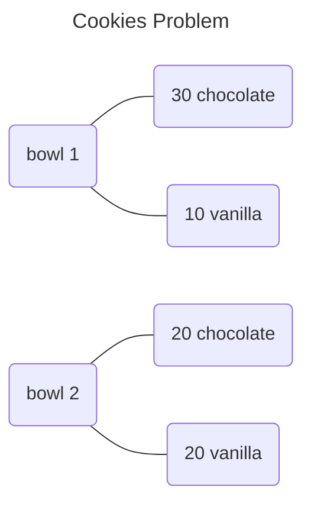

# Bayesian in Python

## Bayesian Theorem

### Theorem 1
>$$P(A | B) = \frac{P(A \cap B)}{P(B)}$$

### Theorem 2
>$$P(A | B) = \frac{P(B | A) \times P(A)}{P(B)}$$

### Theorem 3
>$$P(A) = \sum_i P(A | B_i) \times P(B_i)$$

## Cookies Problem
Bowl 1 has 30 chocolate and 10 vanilla cookies.
Bowl 2 has 20 chocolate and 20 vanilla cookies.
What is the probability that a chocolate cookies came from Bowl 1?
$$P(\text{bowl}_1 | \text{cookies}_c)$$



### Solution: By Diagram

>$$P(\text{bowl}_1 | \text{cookies}_c) = \frac{30}{30 + 20} = \frac{3}{5}$$

### Solution: By Formula
>$$P(\text{bowl}_1 | \text{cookies}_c) = \frac{\frac{30}{30 + 10} \times \frac{1}{2}}{\frac{30}{30 + 10} \times \frac{1}{2} + \frac{20}{20 + 20} \times \frac{1}{2}} = \frac{3}{5}$$

```python
from fractions import Fraction as frac

p_c_b1: frac = frac(30,(30+10))
p_b1: frac = frac(1, 2)
p_c: frac = frac((30+20), (30+10+20+20))

p_b1_c: frac = p_c_b1 * p_b1 / p_c
print(p_b1_c)
```

>Fraction(3, 5)

### Solution: By Bayes Table

```python
import pandas as pd
from fractions import Fraction as frac

data: dict = {
  "bowl": ["bowl 1", "bowl 2"],
  "prior": [frac(1, 2), frac(1, 2)],
  "likelihood": [frac(30, 40), frac(20, 40)]
}

bayes_table: pd.DataFrame = pd.DataFrame(data)

bayes_table["numerator"] = bayes_table["prior"] * bayes_table["likelihood"]
normaliser: float = bayes_table["numerator"].sum()
bayes_table["posterior"] = bayes_table["numerator"] / normaliser

print(bayes_table)
```

>| | bowl   | prior | likelihood | numerator | posterior |
>|-|:------:|:-----:|:----------:|:---------:|:---------:|
>|0| bowl 1 | 1/2   | 3/4        | 3/8       | 3/5       |
>|1| bowl 2 | 1/2   | 1/2        | 1/4       | 2/5       |

### Solution: By empiricaldist.Pmf

```python
import numpy as np
from empiricaldist import Pmf

prior: Pmf = Pmf.from_seq(["bowl 1", "bowl 2"])
likelihood_chocolate: np.ndarray = np.array([30/40, 20/40])
posterior: Pmf = prior * likelihood_chocolate
posterior.normalize()
print(posterior)
```

><table>
>  <tr>
>    <td>bowl 1</td>
>    <td>0.6</td>
>  </tr>
>  <tr>
>    <td>bowl 2</td>
>    <td>0.4</td>
>  </tr>
></table>

