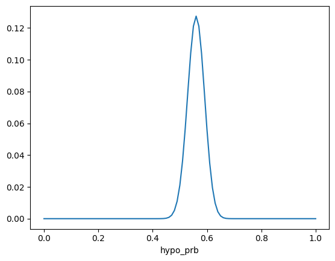
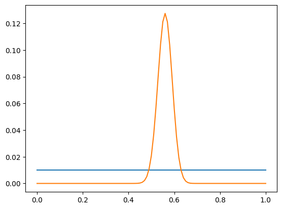
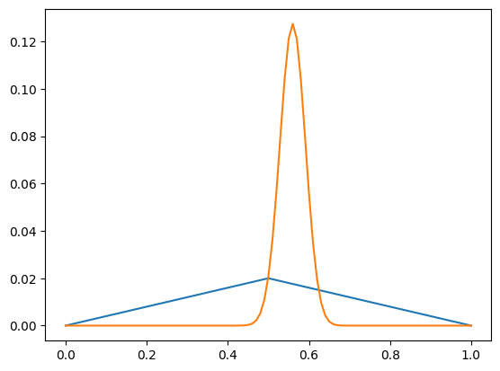
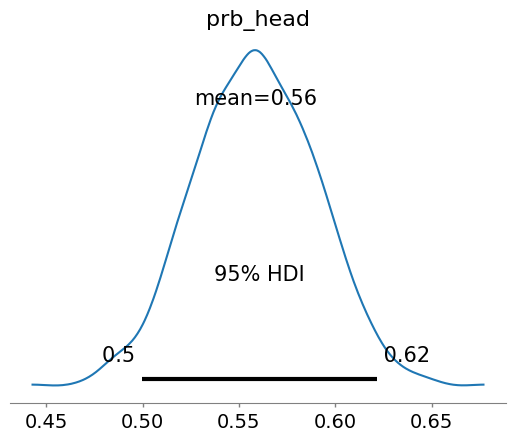
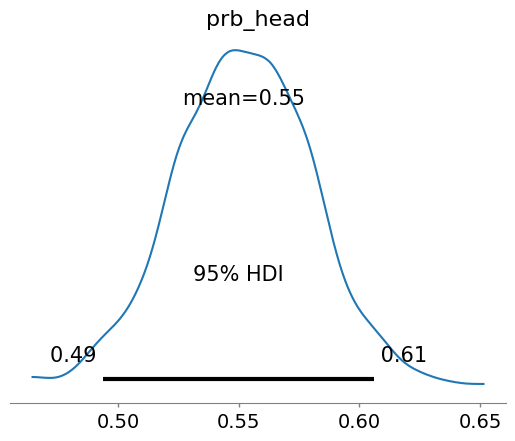

# Is it fair?
*Last updated 2024-10-14*

A total of 250 coin flips was conducted, resulting in 140 heads and 110 tails. The objective is to determine the probability that the coin lands on heads, and whether it can be considered fair. This analysis will be performed using Bayesian inference with the following approaches:
* Bayes Table using `pandas.DataFrames`
* `empiricaldist.Pmf` library
* `PyMC` with uniform and Beta priors

## Bayesian Inference Overview

Bayes’ theorem is applied to update the probability of a hypothesis based on observed data. In this context:
* **Prior**: An initial assumption about the fairness of the coin.
* **Likelihood**: The probability of obtaining the observed outcomes for a given hypothesis.
* **Posterior**: The updated belief about the coin’s fairness after observing the results.

The formula for Bayes’ theorem is:
> $$P(\text{head | obs}) = \frac{P(\text{prior}) \times L(\text{head})}{\text{normaliser}}$$

## Approach 1: Bayes Table with `pandas.DataFrame`

Bayes’ Theorem offers a structured way to update the probability of a hypothesis based on observed data. In the case of a coin flip, each outcome follows a Bernoulli distribution since the result can either be heads (success) or tails (failure). The Bernoulli probability mass function (PMF) is defined as:
> $$P(\text{head}) = h$$
> $$P(\text{tail}) = (1-h)$$

When multiple independent flips are performed, the probability of observing a specific sequence of outcomes — given the hypothesized probability *h* — is modeled using a binomial distribution. The likelihood function is expressed as:
> $$L(h | H, T) = h^H \times (1-h)^T$$

This formula gives the probability of obtaining exactly *H* heads and *T* tails for a given value of *h*. By incorporating this likelihood into Bayes’ Theorem, the posterior probability is calculated as:
> $$P(\text{head | (H,T)}) = \frac{p \times h^H \times (1-h)^T}{\text{normaliser}}$$

Here, *p* represents the prior probability, which is assumed to be uniform, meaning all values of *p* are initially considered equally likely.

In this analysis, the probability space is divided into increments of 0.01, covering the range from 0 to 1. For each possible value of *h*, the prior is multiplied by the likelihood of observing 140 heads and 110 tails. The normaliser ensures that the sum of the posterior probabilities equals 1.

After performing the calculations, the maximum posterior probability (MAP estimate) is identified at `bayes_table['head_posterior'].idxmax()`, which produces `h = 0.56`. This suggests that the coin is slightly biased toward heads.

```python
import numpy as np
import pandas as pd

head: int = 140
tail: int = 110

bayes_table: pd.DataFrame = pd.DataFrame({
    "hypo_prb": np.linspace(0, 1, 101),  # 0.00, 0.01, 0.02, ... 0.98, 0.99, 1.00
    "head_prior": 1/100,  # uniform probability of 0.01
    "likeli_head": np.linspace(0, 1, 101)  # 0.00, 0.01, 0.02, ... 0.98, 0.99, 1.00
})

bayes_table.set_index("hypo_prb", inplace=True)

bayes_table["numerator"] = (bayes_table["head_prior"] *
                            (bayes_table["likeli_head"]**head) *
                            (1 - bayes_table["likeli_head"])**tail)

normaliser: float = bayes_table["numerator"].sum()
bayes_table["head_posterior"] = bayes_table["numerator"] / normaliser

bayes_table["head_posterior"].plot()
```



## Approach 2: Using empiricaldist.Pmf

The `empiricaldist.Pmf` library was employed to simplify calculations by representing both priors and posteriors as probability mass functions (PMFs). Two scenarios were considered under this approach:

1. Uniform Prior: All possible values for the probability of heads were assigned equal likelihood, reflecting complete uncertainty.
2. Triangular Prior: A prior was centered around fairness `h = 0.5`, to investigate whether such an assumption would influence the posterior distribution.

### Uniform Prior Analysis

In the first scenario, a uniform prior was applied, treating each value from 0 to 1 as equally likely. For every hypothesis *h*, the posterior was calculated by multiplying the prior with the likelihood of observing 140 heads and 110 tails. The posterior was then normalized to ensure that all probabilities summed to 1.

```python
import numpy as np

from empiricaldist import Pmf

prb_space: np.ndarray = np.linspace(0, 1, 101)

head: int = 140
tail: int = 110

def calc_posterior(prior: Pmf, space: np.ndarray, head: int, tail: int) -> Pmf:
  posterior = prior * (space**head) * ((1-space)**tail)
  posterior.normalize()

  return posterior


prior_uniform_head: Pmf = Pmf(1, prb_space)
prior_uniform_head.normalize()
prior_uniform_head.plot()

posterior_uniform_head = calc_posterior(prior_uniform_head, prb_space, head, tail)
posterior_uniform_head.normalize()
posterior_uniform_head.plot()
```



```python
posterior_uniform_head.mean(), posterior_uniform_head.max_prob()
```
> (0.5595238095238096, 0.56)

```python
posterior_uniform_head.credible_interval(0.95)
```
> array([0.5 , 0.62])

The mean posterior probability was found to be approximately 0.56, which aligns with the result from the previous approach. The maximum posterior probability (MAP estimate) was also identified at 0.56. Additionally, the 95% credible interval was determined to be [0.5, 0.62], suggesting that the true probability of heads likely falls within this range.

These results indicate that the coin is slightly biased toward heads.

### Triangular Prior Analysis

To explore whether an assumption favoring fairness `h = 0.5` would affect the outcome, a triangular prior was applied. This prior assigns higher probability near 0.5, with decreasing probabilities towards the extremes (0 and 1).

```python
tri_prb: np.ndarray = np.append(np.arange(50), np.arange(50, -1, -1))

prior_tri_head: Pmf = Pmf(tri_prb, prb_space)
prior_tri_head.normalize()
prior_tri_head.plot()

posterior_tri_head = calc_posterior(prior_tri_head, prb_space, head, tail)
posterior_tri_head.normalize()
posterior_tri_head.plot()
```



```python
posterior_tri_head.mean(), posterior_tri_head.max_prob()
```
> (0.5595238095238096, 0.56)

```python
posterior_tri_head.credible_interval(0.95)
```
> array([0.5 , 0.62])

Despite the change in prior, the posterior distribution remained consistent with the results obtained using the uniform prior. The mean posterior was again found to be approximately 0.56, with a 95% credible interval of [0.5, 0.62].

### Interpretation of Results

The analysis demonstrates that the choice of prior (uniform or triangular) does not significantly influence the results, as the data (140 heads out of 250 flips) is sufficiently informative to dominate the prior. The posterior suggests a slight bias toward heads, with the most likely value for the probability of heads being around 0.56.

## Approach 3: Bayesian Inference with `PyMC`

A model was built using `PyMC`, first with a uniform prior and then with a Beta prior to incorporate stronger assumptions about fairness.

### With Uniform Prior

A uniform prior was defined over the range [0, 1], representing complete uncertainty about the coin’s fairness. The observations were modeled as a binomial distribution, where the total number of flips was set to 250, and the probability of heads was treated as unknown.

```python
import arviz as az
import pymc as pm

with pm.Model() as coin_model:
  # prior
  prb_head = pm.Uniform("prb_head", 0, 1)

  # observation
  pm.Binomial("heads", n=(head + tail), p=prb_head, observed=head)

  # inference
  icoin = pm.sample()


az.summary(icoin)
```
|        |mean | sd  |hdi_2.5%|hdi_97.5%|mcse_mean|mcse_sd|ess_bulk|ess_tail|r_hat|
|:------:|:---:|:---:|:------:|:-------:|:-------:|:-----:|:------:|:------:|:---:|
|prb_head|0.559|0.032| 0.499  |  0.622  |  0.001  | 0.001 | 753.0  | 1360.0 | 1.0 |

```python
az.plot_posterior(icoin, hdi_prob=0.95)
```



The posterior summary is as follows:

* Mean: 0.559
* 95% HDI (Highest Density Interval): [0.499, 0.622]

These results align with those from the earlier methods, suggesting a slight bias towards heads.

### With Informative Beta Prior

A Beta prior was introduced with parameters `alpha = 20` and `beta = 20`, reflecting a strong belief that the coin is fair `h = 0.5`.

```python
with pm.Model() as coin_model:
  # prior
  prb_head = pm.Beta("prb_head", alpha=20, beta=20)

  # observation
  pm.Binomial("heads", n=(head + tail), p=prb_head, observed=head)

  # inference
  icoin = pm.sample()


az.summary(icoin, hdi_prob=0.95)
```
|        |mean | sd  |hdi_2.5%|hdi_97.5%|mcse_mean|mcse_sd|ess_bulk|ess_tail|r_hat|
|:------:|:---:|:---:|:------:|:-------:|:-------:|:-----:|:------:|:------:|:---:|
|prb_head|0.552|0.028| 0.494  |  0.606  |  0.001  | 0.001 | 918.0  | 1123.0 | 1.0 |

```python
az.plot_posterior(icoin, hdi_prob=0.95)
```



Even with this strong prior, the data-driven posterior indicated a bias towards heads, as summarized below:

* Mean: 0.552
* 95% HDI: [0.494, 0.606]

This demonstrates that although the prior suggested fairness, the observed data shifted the posterior towards a bias.

## Key Insights from the Analysis

* Prior Influence: Although a Beta prior expressed confidence in fairness, the observed data still led to the conclusion that the coin is biased
* Posterior Uncertainty: The 95% credible interval ([0.5, 0.62]) shows that there is some uncertainty in the estimate
* This consistency across different priors highlights how Bayesian methods can incorporate prior beliefs while ensuring that strong data can override those assumptions
* Choice of Tools: While the `Bayes Table` and `empiricaldist.Pmf` offer transparency, PyMC provides flexibility and efficiency for more complex modeling

## Conclusion

All methods converge on the same conclusion that the probability of heads is estimated to be approximately 0.56, indicating a slight bias towards heads. Although an informative prior favoring fairness was tested, the data suggested otherwise. The results demonstrate how Bayesian methods allow prior beliefs to be incorporated but also updated based on evidence.

## References
+ [Think Bayes 2](http://allendowney.github.io/ThinkBayes2/index.html)

*[Table of Content](../../index.md)*
