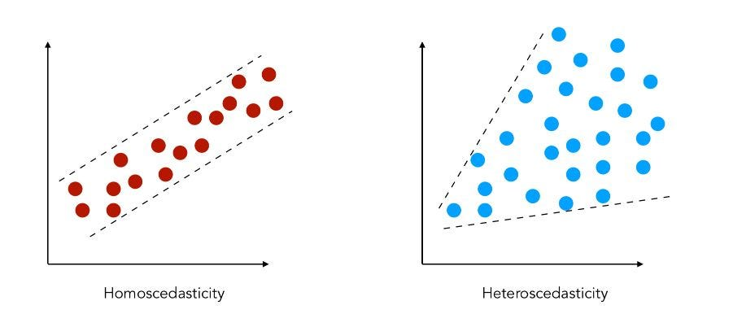
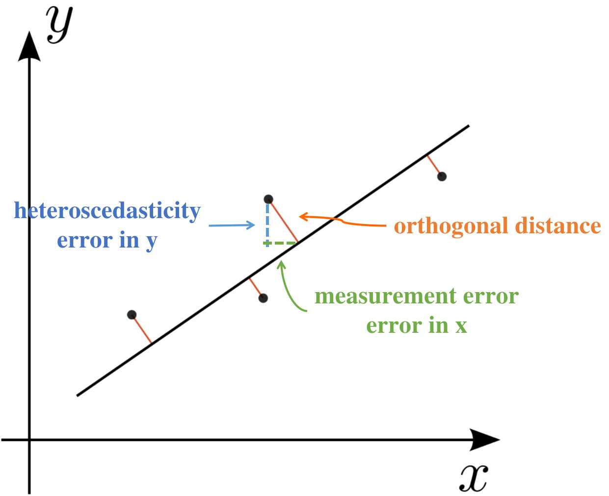

# Bayesian Regression
*Last updated 2025-06-01*

## Classical Linear Regression
### Data
<table>
  <tr>
    <th></th>
    <th>X</th>
    <th>Y</th>
  </tr>
  <tr>
    <td>1</td>
    <td>0.500</td>
    <td>0.500</td>
  </tr>
  <tr>
    <td>2</td>
    <td>2.372</td>
    <td>2.376</td>
  </tr>
  <tr>
    <td>3</td>
    <td>4.247</td>
    <td>4.248</td>
  </tr>
  <tr>
    <td>4</td>
    <td>6.118</td>
    <td>6.131</td>
  </tr>
  <tr>
    <td>5</td>
    <td>7.996</td>
    <td>7.990</td>
  </tr>
</table>

### Linear Regression Model
OLS Model produced using `statsmodel` *code not shown*

$$Y = 0.0031 + 0.9998X$$
$$\text{95% CI of intercept} = \text{[-0.018 , 0.025]}$$
$$\text{95% CI of slope} = \text{[0.996 , 1.004]}$$

## Bayesian Regression (Simple)
### Modelling Using PyMC
Same import throughout this article
```python
import arviz as az
import pymc as pm
```

```python
with pm.Model() as linmodel:
  # prior
  intercept = pm.Normal("intercept", mu=0, sigma=1)
  slope = pm.Normal("slope", mu=1, sigma=1)
  sigma = pm.HalfNormal("sigma", sigma=1)

  # model
  y_pred = pm.Deterministic("model", intercept + slope * (X))

  # likelihood
  pm.Normal("y_pred", mu=y_pred, sigma=sigma, observed=Y)

  # inference data
  idata = pm.sample(2000, cores=4, nuts_kwargs={"target_accept": 0.95})
```

Always use *Arviz*
- to produce the summary of the analysis / model
- hdi_prob always set to 0.95

### linmodel

$$Y = 0.003 + 1.000X$$
$$\text{95% CrI of intercept} = \text{[-0.039 , 0.038]}$$
$$\text{95% CrI of slope} = \text{[0.993 , 1.008]}$$

## Heteroscedasticity in Bayesian
Heteroscedasticity = proportional error in the Y variable


OLS assumes homoscedasticity, not suitable.
Frequentist solution is to use weighted least squares. WLS is nuanced and not straightforward.

### Data
<table>
  <tr>
    <th></th>
    <th>X</th>
    <th>y1</th>
    <th>y2</th>
    <th>y3</th>
    <th>Y = mean of y</th>
    <th>sdy = std of y</th>
  </tr>
  <tr>
    <td>1</td>
    <td>0.500</td>
    <td>0.549</td>
    <td>0.549</td>
    <td>0.550</td>
    <td>0.549</td>
    <td>0.001</td>
  </tr>
  <tr>
    <td>2</td>
    <td>2.372</td>
    <td>2.614</td>
    <td>2.616</td>
    <td>2.615</td>
    <td>2.615</td>
    <td>0.001</td>
  </tr>
  <tr>
    <td>3</td>
    <td>4.251</td>
    <td>4.667</td>
    <td>4.691</td>
    <td>4.680</td>
    <td>4.680</td>
    <td>0.010</td>
  </tr>
  <tr>
    <td>4</td>
    <td>6.134</td>
    <td>6.751</td>
    <td>6.735</td>
    <td>6.736</td>
    <td>6.741</td>
    <td>0.007</td>
  </tr>
  <tr>
    <td>5</td>
    <td>7.998</td>
    <td>8.791</td>
    <td>8.784</td>
    <td>8.813</td>
    <td>8.796</td>
    <td>0.013</td>
  </tr>
</table>

### Modelling Heteroscedasticity
WLS Model produced using `statsmodel` *code not shown*

$$Y = 0.0057 + 1.0989X$$
$$\text{95% CI of intercept} = \text{[-0.014 , 0.025]}$$
$$\text{95% CI of slope} = \text{[1.096 , 1.102]}$$

#### Using PyMC  
Slight edition to the basic code. In the likelihood of y_pred, the sigma is now informative (from the data) and not sampled from a HalfNormal distribution anymore.

```python
with pm.Model() as hetmodel:
  # prior
  intercept = pm.Normal("intercept", mu=0, sigma=1)
  slope = pm.Normal("slope", mu=1, sigma=1)
  
  # model
  y_pred = pm.Deterministic("model", intercept + slope * (X))

  # likelihood
  pm.Normal("y_pred", mu=y_pred, sigma=sdy, observed=Y)

  # inference data
  idata = pm.sample(2000, cores=4, nuts_kwargs={"target_accept": 0.95})
```

#### hetmodel
$$Y = -0.001 + 1.102X$$
$$\text{95% CrI of intercept} = \text{[-0.003 , 0.001]}$$
$$\text{95% CrI of slope} = \text{[1.101 , 1.103]}$$

## Error-in-variables (Uncertainty in X and Y)
Both X and Y has measurement error.



Frequestist analysis becomes much more complicated. One of the popular solution is by using weighted Deming regression.

### Data

<table>
  <tr>
    <th></th>
    <th>x1</th>
    <th>x2</th>
    <th>x3</th>
    <th>y1</th>
    <th>y2</th>
    <th>y3</th>
    <th>X = mean of x</th>
    <th>sdx = std of x</th>
    <th>Y = meand of y</th>
    <th>sdy = std of y</th>
  </tr>
  <tr>
    <td>1</td>
    <td>0.701</td>
    <td>0.701</td>
    <td>0.699</td>
    <td>0.746</td>
    <td>0.750</td>
    <td>0.749</td>
    <td>0.700</td>
    <td>0.001</td>
    <td>0.749</td>
    <td>0.002</td>
  </tr>
  <tr>
    <td>2</td>
    <td>2.575</td>
    <td>2.577</td>
    <td>2.577</td>
    <td>2.814</td>
    <td>2.809</td>
    <td>2.814</td>
    <td>2.576</td>
    <td>0.001</td>
    <td>2.812</td>
    <td>0.002</td>
  </tr>
  <tr>
    <td>3</td>
    <td>4.449</td>
    <td>4.440</td>
    <td>4.452</td>
    <td>4.876</td>
    <td>4.881</td>
    <td>4.878</td>
    <td>4.447</td>
    <td>0.005</td>
    <td>4.878</td>
    <td>0.002</td>
  </tr>
  <tr>
    <td>4</td>
    <td>6.334</td>
    <td>6.328</td>
    <td>6.318</td>
    <td>6.946</td>
    <td>6.939</td>
    <td>6.932</td>
    <td>6.327</td>
    <td>0.007</td>
    <td>6.939</td>
    <td>0.006</td>
  </tr>
  <tr>
    <td>5</td>
    <td>8.198</td>
    <td>8.197</td>
    <td>8.206</td>
    <td>9.004</td>
    <td>9.001</td>
    <td>9.005</td>
    <td>8.200</td>
    <td>0.004</td>
    <td>9.003</td>
    <td>0.002</td>
  </tr>
</table>

Weighted Deming Regression produced by using `scipy` *code not shown*

$$Y = -0.0227 + 1.1008X$$
$$\text{95% CI of intercept} = \text{[-0.0268 , -0.0186]}$$
$$\text{95% CI of slope} = \text{[1.0995 , 1.1020]}$$

#### Using PyMC  
Slight edition to the basic code. In the likelihood of y_pred, the sigma is now informative (from the data) and not sampled from a HalfNormal distribution anymore. On the other hand, a latent variable x_mean was created with its prior set to the observed x.

```python
with pm.Model() as errmodel:
  # prior
  intercept = pm.Normal("intercept", mu=0, sigma=5)
  slope = pm.Normal("slope", mu=1, sigma=5)
  x_mean = pm.Normal("x_mean", mu=X, sigma=sdx)
  
  # model
  y_pred = pm.Deterministic("model", intercept + slope * (x_mean))

  # likelihood
  pm.Normal("y_pred", mu=y_pred, sigma=sdy, observed=Y)

  # inference data
  idata = pm.sample(2000, cores=4, nuts_kwargs={"target_accept": 0.95})
```

#### errmodel

$$Y = -0.022 + 1.101X$$
$$\text{95% CrI of intercept} = \text{[-0.026 , -0.018]}$$
$$\text{95% CrI of slope} = \text{[1.099 , 1.102]}$$

*[Table of Content](../../index.md)*
